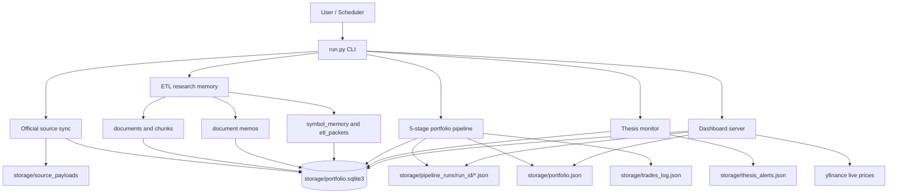
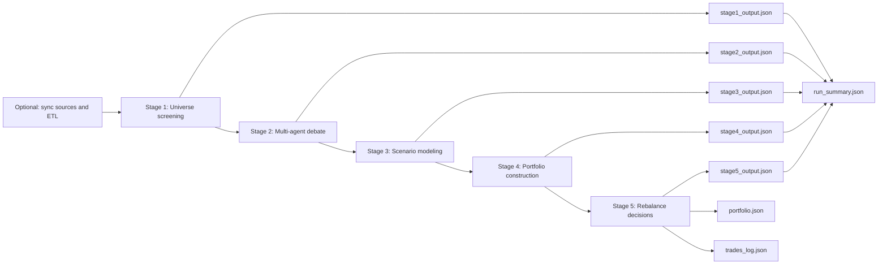
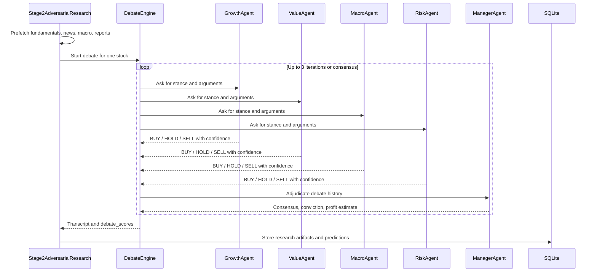
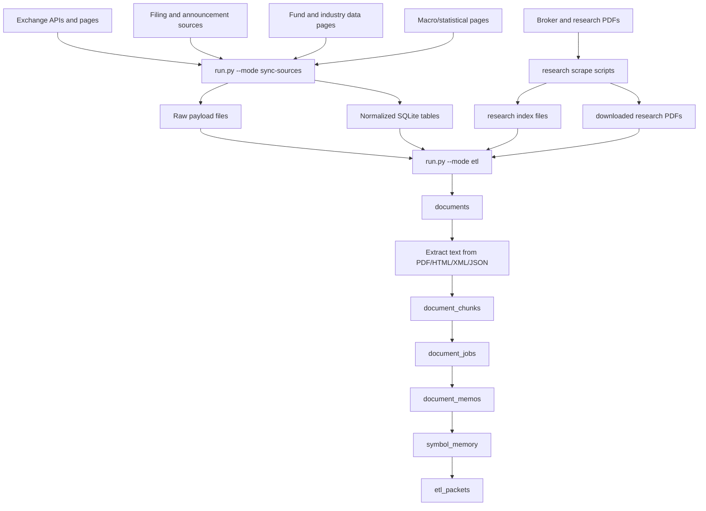
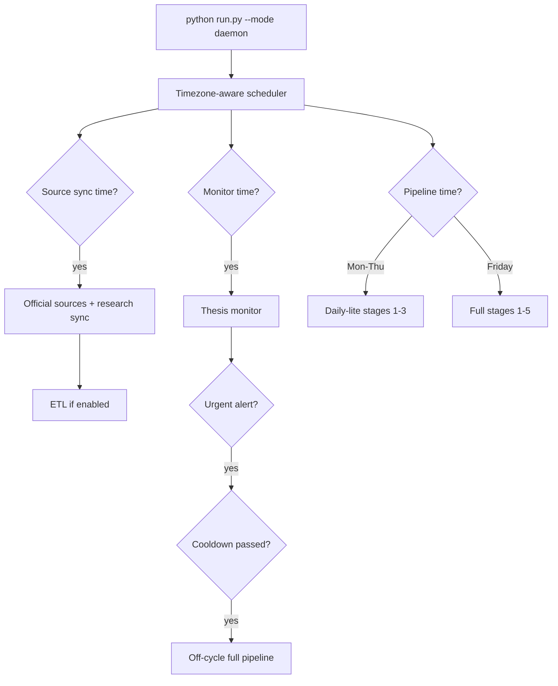

# Market AI Portfolio Pipeline

An end-to-end research and paper-portfolio system for equities and market
research. The repo builds a configured stock universe, fetches market data and
official-source context, runs a multi-agent investment debate, models expected
returns, constructs a constrained portfolio, and records rebalance decisions for
review in a local dashboard.

This is a research and paper-trading project. It is not financial advice and it
does not place real trades.

## What This Repo Does

In plain English, the system answers one question:

> From the configured equity universe, which stocks currently have the strongest
> risk-adjusted expected return, and how should a paper portfolio be allocated?

It does that in three connected layers:

1. **Data layer**: downloads universe, prices, fundamentals, news, official
   filings, corporate actions, financial results, and analyst-report material.
2. **Research layer**: uses multiple LLM agents to debate each candidate stock,
   convert the debate into probabilities, and create bull/base/bear scenarios.
3. **Portfolio layer**: picks positions, enforces allocation constraints, logs
   trades, and exposes the results through JSON, SQLite, and a browser dashboard.

## High-Level Architecture



## Repository Layout

| Path | Purpose |
| --- | --- |
| `run.py` | Main CLI entrypoint for pipeline, daily-lite, monitor, scheduler, daemon, ETL, source sync, status, and dashboard. |
| `config.py` | Central configuration: paths, model choices, portfolio constraints, cache TTLs, source URLs, scheduler times, ETL budgets. |
| `pipeline/` | Stage orchestration and pipeline stages 1 through 5, ETL, validators, and thesis monitor. |
| `agents/` | LLM agents used for screening, debate, scenario modeling, portfolio rationale, rebalancing, and agent memory. |
| `data/` | Universe loading, yfinance fundamentals/prices, news, official source sync, source registry, analyst reports, caching. |
| `llm/` | Provider routing and JSON extraction utilities. Supports Anthropic, Gemini, Groq, Mistral, and OpenAI-compatible endpoints. |
| `persistence/` | SQLite schema and read/write helpers for runs, positions, trades, source data, ETL packets, and decision artifacts. |
| `dashboard/` | Local HTTP dashboard server with static HTML/CSS/JS and JSON API endpoints. |
| `scripts/` | Source-sync/debug and research scraping helpers. |
| `tests/` | Unit tests for ETL, source normalization, JSON extraction, debate scoring, stage normalization, and portfolio constraints. |
| `storage/` | Generated artifacts, SQLite DB, downloaded raw payloads, run outputs, PDFs, browser profiles, portfolio state, and caches. |
| `requirements.txt` | Python dependencies used by the project. |

## End-to-End Pipeline Diagram



## Pipeline Stages

| Stage | Code | Input | What Happens | Output |
| --- | --- | --- | --- | --- |
| 1. Universe screening | `pipeline/stage1_screening.py` | Configured equity universe, yfinance fundamentals, live prices, macro context | Scores every stock using valuation, quality, growth, and momentum factors. Optionally asks an LLM to review the top quant names. | Top candidates in `stage1_output.json`; normally `STAGE1_TOP_N=50`. |
| 2. Multi-agent adversarial research | `pipeline/stage2_adversarial.py`, `agents/debate_engine.py` | Stage 1 candidates, fundamentals, news, analyst reports, macro context | Runs a LangGraph debate among growth, value, macro, and risk agents. A manager adjudicates and produces debate probabilities. | Per-stock debate transcript, bull/bear summaries, debate scores, conviction, and synthesis packet in `stage2_output.json`. |
| 3. Scenario modeling | `pipeline/stage3_scenarios.py` | Stage 2 debate packets and probabilities | Builds bull/base/bear price-target scenarios. Expected value is computed from debate probabilities times scenario returns. Selection pressure filters weak positives. | EV-ranked scenario models in `stage3_output.json`. |
| 4. Portfolio construction | `pipeline/stage4_construction.py` | Stage 3 scenario models and current portfolio | Selects eligible positive-EV stocks and computes deterministic weights from EV times conviction. Enforces position and sector caps. | Target portfolio and exclusions in `stage4_output.json`. |
| 5. Rebalancing | `pipeline/stage5_rebalance.py` | New target portfolio, current portfolio, scenario context | Creates BUY/SELL/HOLD recommendations. First run generates initial BUYs; later runs diff current vs target. | Trades in `stage5_output.json`, persistent `portfolio.json`, `trades_log.json`, and SQLite rows. |

## Stage 2 Debate Flow



## ETL Pipeline

The ETL pipeline is separate from the five-stage portfolio run. Its job is to
turn raw official-source data and research documents into compact, per-symbol
memory packets that are stored for inspection and reuse without repeatedly
reading long PDFs, HTML pages, or raw exchange payloads. Stage 2 also fetches
fresh fundamentals, news, macro context, and analyst reports directly during a
pipeline run; ETL is the persistent research-memory layer around those live
fetches.



### ETL Steps

| Step | Code | Description | Main Tables / Files |
| --- | --- | --- | --- |
| Source sync | `data/official_sources.py` | Downloads verified and candidate data from configured official and near-official market sources. Persists raw payloads and normalized rows. | `source_payloads`, `corporate_actions`, `financial_results`, `filings`, `bulk_deals`, `block_deals`, `results_calendar`, `reference_data`, `macro_drivers`. |
| Analyst report sync | Research scraping scripts | Scrapes configured research-report PDFs into local storage and an index file. | Research PDF files and index records under `storage/`. |
| Document ingestion | `pipeline/etl_pipeline.py` | Converts normalized rows and analyst-report index records into canonical `documents`. | `documents`. |
| Text extraction | `pipeline/etl_pipeline.py` | Extracts text from local PDF, HTML, XML, JSON, or source payload text. | `documents.extracted_text`, `document_chunks`. |
| Memo job queue | `pipeline/etl_pipeline.py` | Queues research memo jobs for extracted documents. | `document_jobs`. |
| Memo generation | `pipeline/etl_pipeline.py` | Creates normalized memos using the configured ETL memo model, with heuristic fallbacks for analyst reports and filings. | `document_memos`. |
| Symbol memory rebuild | `pipeline/etl_pipeline.py` | Aggregates recent memos, event counts, and latest structured events for each symbol. | `symbol_memory`. |
| Packet build | `pipeline/etl_pipeline.py` | Builds compact, date-stamped research packets for downstream use. | `etl_packets`. |

## Data and Storage Model

```mermaid
erDiagram
    runs ||--o{ positions : saves
    runs ||--o{ trades : records
    runs ||--o{ research_artifacts : stores
    runs ||--o{ decision_artifacts : stores

    source_payloads ||--o{ filings : normalizes
    source_payloads ||--o{ financial_results : normalizes
    source_payloads ||--o{ corporate_actions : normalizes
    source_payloads ||--o{ bulk_deals : normalizes
    source_payloads ||--o{ block_deals : normalizes
    source_payloads ||--o{ results_calendar : normalizes

    documents ||--o{ document_chunks : chunks
    documents ||--o{ document_jobs : queues
    documents ||--o{ document_memos : summarizes
    symbol_memory ||--o{ etl_packets : builds

    current_positions ||--o{ thesis_checks : monitored_by
```



Key generated artifacts:

| Artifact | Meaning |
| --- | --- |
| `storage/pipeline_runs/<run_id>/stage1_output.json` | Stage 1 universe screening output. |
| `storage/pipeline_runs/<run_id>/stage2_output.json` | Multi-agent research and debate results. |
| `storage/pipeline_runs/<run_id>/stage3_output.json` | Scenario models and EV ranking. |
| `storage/pipeline_runs/<run_id>/stage4_output.json` | Target portfolio and excluded names. |
| `storage/pipeline_runs/<run_id>/stage5_output.json` | BUY/SELL/HOLD trade recommendations. |
| `storage/pipeline_runs/<run_id>/run_summary.json` | Runtime, stage counts, token totals, warnings, and run directory. |
| `storage/portfolio.json` | Latest current paper portfolio. |
| `storage/trades_log.json` | Historical rebalance log. |
| `storage/thesis_alerts.json` | Thesis-monitor alerts by date. |
| `storage/portfolio.sqlite3` | Main operational database for runs, positions, source data, ETL, and artifacts. |
| `.cache/` | Local cache for yfinance, news, universe, macro, live price, and report fetches. |

## CLI Modes

All common operations go through `run.py`.

```bash
python run.py --mode status
python run.py --mode test-data
python run.py --mode sync-sources
python run.py --mode etl
python run.py --mode pipeline
python run.py --mode pipeline --stages 1-3
python run.py --mode daily
python run.py --mode monitor
python run.py --mode dashboard
python run.py --mode daemon
```

| Mode | Description |
| --- | --- |
| `status` | Prints current portfolio and last rebalance summary. Default mode. |
| `test-data` | Smoke-tests universe, fundamentals, news, macro, and official-source sync with no portfolio run. |
| `sync-sources` | Downloads official/near-official raw payloads and normalizes them into SQLite. |
| `etl` | Builds document memos, symbol memory, and ETL packets from normalized source data. |
| `pipeline` | Runs the full or partial five-stage portfolio pipeline. |
| `daily` | Daily-lite run: full Stage 1 plus a small Stage 2/3 shortlist of flagged holdings and new candidates. |
| `monitor` | Checks current holdings for recent news that may breach the thesis. |
| `schedule` | Simple every-N-days scheduler plus daily thesis monitor. |
| `daemon` | Timezone-aware autonomous loop for source sync, ETL, monitor, daily-lite, and full Friday runs. |
| `dashboard` | Starts the custom local dashboard at `http://127.0.0.1:8765`. |

### Partial Pipeline and Resume Inputs

Run only a subset:

```bash
python run.py --mode pipeline --stages 1-3
python run.py --mode pipeline --stages 4-5
```

Reuse existing stage outputs:

```bash
python run.py --mode pipeline --stages 2-3 --stage1-file storage/pipeline_runs/<run_id>/stage1_output.json
python run.py --mode pipeline --stages 3-5 --stage2-file storage/pipeline_runs/<run_id>/stage2_output.json
```

## Setup

### 1. Create a virtual environment

```bash
python3 -m venv .venv
source .venv/bin/activate
pip install -r requirements.txt
```

The debate engine imports `langgraph`. If it is not already installed in your
environment, add it:

```bash
pip install langgraph
```

If you use browser-backed official-source fallback or research-report scraping,
install a Chromium browser for Playwright:

```bash
python -m playwright install chromium
```

### 2. Configure environment variables

Create a `.env` file in the repo root. You only need keys for the model provider
you plan to use.

```bash
# Anthropic default path
ANTHROPIC_API_KEY=...

# Optional providers
GEMINI_API_KEY=...
GROQ_API_KEY=...
MISTRAL_API_KEY=...

# OpenAI-compatible / self-hosted endpoint
OPENAI_COMPAT_BASE_URL=https://your-host/v1
OPENAI_COMPAT_API_KEY=...
OPENAI_COMPAT_MODEL=your-model-name

# Optional news and analyst access
NEWS_API_KEY=...
BUSINESS_STANDARD_COOKIE=...
```

Model variables can be prefixed by provider:

```bash
MODEL_FAST=gemini:gemma-4-31b-it
MODEL_SMART=groq:llama-3.1-70b-versatile
STAGE3_MODEL=openai:Qwen/Qwen2.5-32B-Instruct
```

If `OPENAI_COMPAT_BASE_URL` and `OPENAI_COMPAT_MODEL` are set, unprefixed
non-Claude model names are routed through the OpenAI-compatible client.

### 3. Run a data smoke test

```bash
python run.py --mode test-data
```

### 4. Sync sources and build ETL memory

```bash
python run.py --mode sync-sources
python run.py --mode etl
```

### 5. Run the portfolio pipeline

```bash
python run.py --mode pipeline
```

A full run may take hours depending on model latency and configured worker
counts. The default comments in `run.py` estimate roughly 2-3 hours for a full
five-stage run.

### 6. Open the dashboard

```bash
python run.py --mode dashboard
```

Then open:

```text
http://127.0.0.1:8765
```

## Important Configuration

Most knobs live in `config.py` and can be overridden through `.env`.

| Setting | Default | Meaning |
| --- | --- | --- |
| Paper portfolio value | `1000000` | Paper capital used for allocation amounts. |
| `MAX_POSITIONS` / `MIN_POSITIONS` | `15` / `10` | Portfolio size bounds. |
| `MAX_POSITION_PCT` / `MIN_POSITION_PCT` | `0.15` / `0.03` | Per-position max and min allocation. |
| `MAX_SECTOR_PCT` | `0.35` | Maximum allocation to one sector. |
| `STAGE1_TOP_N` | `50` | Stage 1 names advanced. |
| `STAGE2_TOP_N` | `30` | Stage 2 names researched in normal full runs. |
| `PIPELINE_S2_MAX_WORKERS` | `8` | Parallel Stage 2 stock debates. |
| `PIPELINE_S3_MAX_WORKERS` | `8` | Parallel Stage 3 scenario agents. |
| `DEBATE_ROUNDS` | `3` | Debate iteration cap. |
| `DEBATE_AGENTS` | growth, value, macro, risk | Expert agent types in Stage 2. |
| `EV_BUY_THRESHOLD` | `0.05` | Minimum risk-adjusted EV for BUY decisions. |
| `CONSENSUS_BUY_THRESHOLD` | `0.5` | Minimum consensus strength for BUY decisions. |
| `ETL_LOOKBACK_DAYS` | `35` | Window for source documents considered by ETL. |
| `ETL_MAX_DOCS_PER_RUN` | `150` | Max documents ingested/extracted per ETL run. |
| `ETL_MAX_JOBS_PER_RUN` | `30` | Max memo jobs processed per ETL run. |
| `SCHEDULER_TIMEZONE` | Configurable | Daemon scheduling timezone. |
| `DAILY_PIPELINE_TIME` | `21:30` | Daily daemon pipeline time. |
| `DAILY_SOURCE_SYNC_TIME` | `05:15` | Daily source sync time. |
| `DAILY_MONITOR_TIME` | `06:00` | Thesis monitor time. |

## Data Sources

| Source Type | Implementation | Notes |
| --- | --- | --- |
| Universe loader | `data/` universe modules | Default stock-universe adapter with primary and mirror downloads plus validation. |
| Prices and fundamentals | `data/fetcher.py` | yfinance live-ish history, ticker info, 6-month returns, volume, technicals, financial summaries. |
| News | `data/fetcher.py` | Google News RSS, market RSS feeds, Yahoo Finance ticker news, optional NewsAPI. |
| Official exchange/macro data | `data/official_sources.py`, `data/source_registry.py` | Configured registry entries, raw payload persistence, and normalized SQLite tables. |
| Analyst and broker research | `data/analyst_reports.py`, research scraping scripts | RSS/HTML sources and research PDFs when accessible. |
| Market reports | `data/reports.py` | Research papers, daily reports, monthly reports with PDF text excerpts. |

## LLM Provider Routing

`llm/providers.py` routes models by prefix:

| Prefix | Provider |
| --- | --- |
| `claude-*` or no prefix | Anthropic |
| `gemini:<model>` | Gemini |
| `groq:<model>` | Groq |
| `mistral:<model>` | Mistral |
| `openai:<model>` | OpenAI-compatible `/v1/chat/completions` endpoint |
| `lightning:<model>` | Alias for OpenAI-compatible endpoints |

Stage model variables:

```bash
STAGE1_MODEL=...
STAGE2_MODEL=...
STAGE3_MODEL=...
STAGE4_MODEL=...
STAGE5_MODEL=...
ETL_MEMO_MODEL=...
```

The pipeline only requires `ANTHROPIC_API_KEY` when the selected stage models are
Anthropic models.

## Daily Automation

The `daemon` mode runs an autonomous loop:



Useful daemon settings:

```bash
SCHEDULER_TIMEZONE=Your/Timezone
DAILY_SOURCE_SYNC_TIME=05:15
DAILY_MONITOR_TIME=06:00
DAILY_PIPELINE_TIME=21:30
PIPELINE_DAYS=MON,WED,FRI
OFFCYCLE_REBALANCE_ON_URGENT=true
```

## Testing

Run all tests:

```bash
pytest
```

Run focused test groups:

```bash
pytest tests/test_etl_pipeline.py
pytest tests/test_official_sources.py
pytest tests/test_debate_system.py
pytest tests/test_portfolio_constraints.py
pytest tests/test_stage3_normalization.py
```

The tests cover:

| Area | Example Files |
| --- | --- |
| ETL chunking, memo normalization, packet building | `tests/test_etl_pipeline.py` |
| Official source normalization | `tests/test_official_sources.py`, `tests/test_source_registry.py` |
| Debate scoring and validators | `tests/test_debate_system.py` |
| Portfolio allocation constraints | `tests/test_portfolio_constraints.py` |
| Stage 3 EV and scenario normalization | `tests/test_stage3_normalization.py` |
| JSON extraction from model responses | `tests/test_json_extraction.py` |
| OpenAI-compatible config behavior | `tests/test_openai_compat_config.py` |

## How To Explain The System Quickly

Use this as the short walkthrough:

1. **Collect data**: the system gets the configured universe, price/fundamental data,
   news, official filings, exchange events, and analyst reports.
2. **Screen the universe**: Stage 1 scores all stocks and keeps the top names.
3. **Debate each candidate**: Stage 2 makes four specialist agents argue the
   case from growth, value, macro, and risk perspectives.
4. **Turn opinions into probabilities**: the debate output becomes bull/base/bear
   probabilities and a conviction score.
5. **Model expected value**: Stage 3 creates scenario returns and computes EV.
6. **Build a constrained portfolio**: Stage 4 selects positions and enforces max
   position size, minimum position size, and sector caps.
7. **Generate trades**: Stage 5 compares the new target portfolio with current
   holdings and produces BUY/SELL/HOLD decisions.
8. **Monitor between runs**: the thesis monitor checks whether news has broken a
   holding's original investment case.

## Troubleshooting

| Symptom | Likely Cause | Fix |
| --- | --- | --- |
| `ANTHROPIC_API_KEY is not set` | A selected stage model is Anthropic. | Set `ANTHROPIC_API_KEY` or switch models to `gemini:`, `groq:`, `mistral:`, or `openai:`. |
| `ModuleNotFoundError: langgraph` | Debate engine dependency missing from local environment. | Run `pip install langgraph`. |
| Low universe size or coverage errors | Universe, yfinance, or network data is incomplete. | Run `python run.py --mode test-data`, check connectivity, and retry with fresh cache if needed. |
| Official source sync fails or returns 403 | Some official sites block automated sessions. | Use `python run.py --mode sync-sources --show-browser --pause-for-user` or configure browser fallback settings. |
| Research reports are missing | Site access may require cookies or browser scraping. | Configure the relevant source credentials or run the scrape script with a persistent profile. |
| Full pipeline is slow | Stage 2 and Stage 3 are LLM-heavy. | Reduce `STAGE2_TOP_N`, `PIPELINE_S2_MAX_WORKERS`, `PIPELINE_S3_MAX_WORKERS`, or use daily-lite mode. |
| Dashboard has no portfolio | No completed Stage 5 run exists yet. | Run `python run.py --mode pipeline` or inspect a partial run under `storage/pipeline_runs`. |

## Common Workflows

Fresh local run:

```bash
python run.py --mode test-data
python run.py --mode sync-sources
python run.py --mode etl
python run.py --mode pipeline
python run.py --mode dashboard
```

Daily maintenance:

```bash
python run.py --mode sync-sources
python run.py --mode etl
python run.py --mode daily
python run.py --mode monitor
```

Autonomous operation:

```bash
python run.py --mode daemon
```

Inspect latest state:

```bash
python run.py --mode status
```
